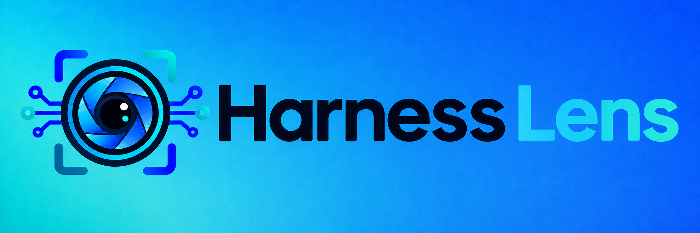

<!-- SPDX-License-Identifier: MPL-2.0 -->
<!-- Copyright © 2026 Cristian Camargo Filho -->



# Harness Lens Homebrew Tap

Official Homebrew tap for Harness Lens native CLI releases.

This repository distributes the native CLI for macOS. Analysis and executable
development live in the [CLI repository](https://github.com/harness-lens/cli).

## Install

After the first public release publishes the formula:

```bash
brew install harness-lens/tap/harness-lens
```

This command adds the public tap and installs the formula. Every formula change
is checked on native Apple Silicon and Intel macOS runners before release.

## Release automation

`Formula/harness-lens.rb` is generated from the reviewed native release
archives and their SHA-256 checksums. Do not edit release URLs or checksums by
hand. The CLI release workflow updates only that formula after its protected
release stage completes, when tap publishing is enabled and configured.

In the CLI repository, set `HOMEBREW_TAP_PUBLISH_ENABLED=true` and configure
`HARNESS_LENS_APP_ID` and `HARNESS_LENS_APP_PRIVATE_KEY`. The GitHub App must
be installed on this tap with permission to write repository contents and
satisfy its branch protection requirements.

See the [CLI native distribution guide](https://github.com/harness-lens/cli/blob/main/docs/distribution.md)
for release review and publishing setup.

## Ecosystem

- [CLI](https://github.com/harness-lens/cli)
- [Core](https://github.com/harness-lens/core)
- [SDK](https://github.com/harness-lens/sdk)
- [Language Server](https://github.com/harness-lens/language-server)
- [VS Code](https://github.com/harness-lens/harness-lens-vscode)
- [Project hub](https://github.com/harness-lens/harness-lens)

## Support and contributions

Report tap installation or packaging problems in
[this repository's issues](https://github.com/harness-lens/homebrew-tap/issues).
Report scanner behavior in [CLI issues](https://github.com/harness-lens/cli/issues).
See [CONTRIBUTING](CONTRIBUTING.md) before changing generated formula files.
For vulnerabilities, follow the [CLI security policy](https://github.com/harness-lens/cli/security/policy).
Do not post credentials or private harness contents in public issues.

## License and branding

Source files are licensed under [MPL-2.0](LICENSE). See [COPYRIGHT](COPYRIGHT)
and [TRADEMARKS](TRADEMARKS) for attribution and the existing Harness Lens
branding policy. Original banner and logo sources are recorded in
[assets/README.md](assets/README.md).
